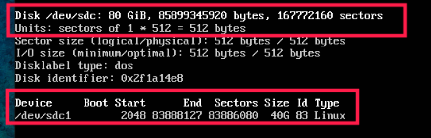
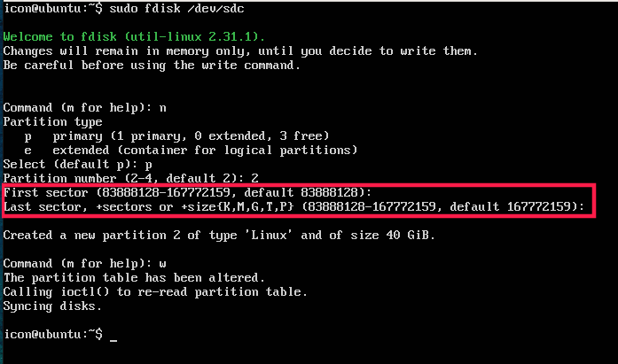
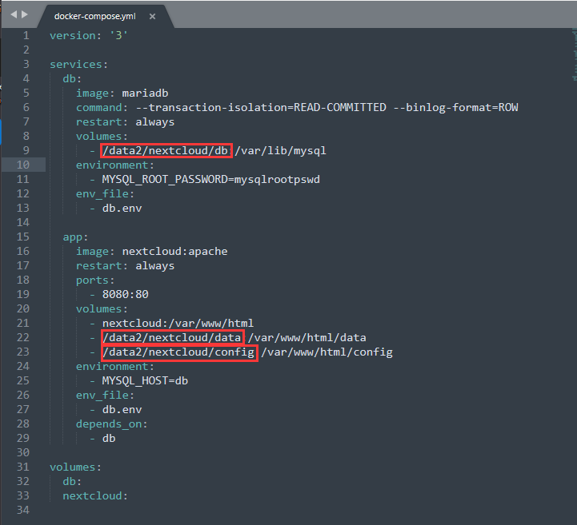
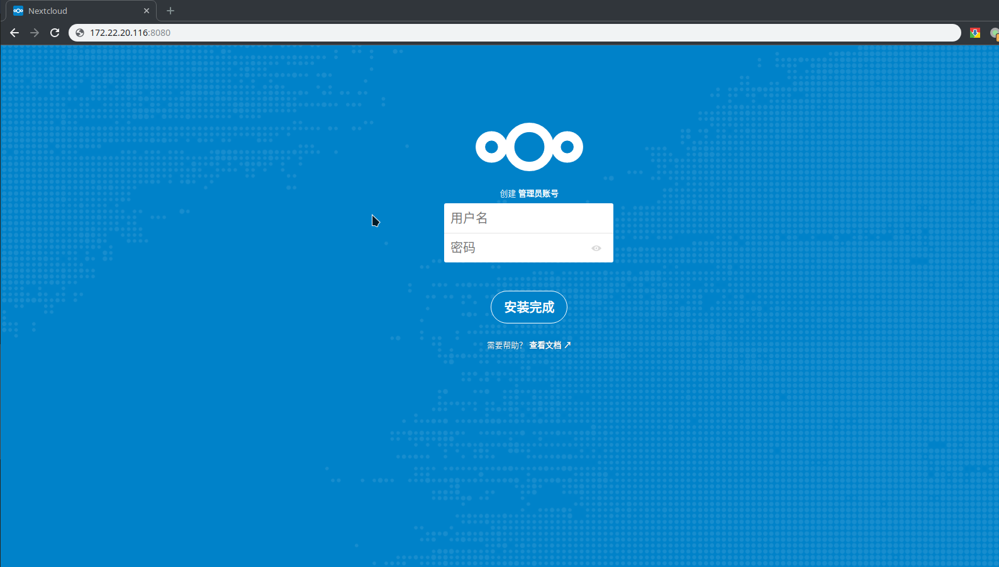

# 网盘服务
## 实验室的文件的储存分享
### 使用nextcloud的docker镜像

>## 安装docker和docker-compose 
>### [官方网址](https://docs.docker.com/install/linux/docker-ce/ubuntu/ "docker安装") 

## 储存路径的分配
>## 格式化
>>### 如果直接安装的话是安装在系统盘，所有数据都在系统盘，这不是我们想要的
>>### 在虚拟化的文档中我们将data的硬盘分出了一半用来作为虚拟化容器的储存池，还有另一半就作为其他的应用的数据储存了
>>### 如图所示
>>>### `sudo apt fdisk -l`
>>### 
>>### data硬盘在上一次已经分出了一半给了其他接下来我们要将另一半进行分区
>>### 
>>###
>>### 格式化sdc的第二个分区  
>>### 将硬盘新分区格式化成ext4  
>>>## `sudo mkfs -t ext4 /dev/sdc2`
>## 挂载
>>### 将这个分区挂载到/data中
>>>### `sudo mkdir /data`
>>>### `sudo mount /dev/sdc2 /data/` 
>>### 开机自动挂载
>>>### `sudo vim /etc/fstab`
>>### 最后一行加入 
>>>### `/dev/sdc1  /data   ext4 defaults 0 0`
## docker-compose
>## [本文参考地址](https://docs.docker.com/samples/library/nextcloud/ "nextcloud的docker镜像")
>>## 在data中新建文件，用于存放网盘产生的数据文件
>>>### `sudo mkdir -p /data/nextcloud/db`
>>>### `sudo mkdir -p /data/nextcloud/data`
>>>### `sudo mkdir -p /data/nextcloud/config`
>>## 下载docker-compose文件
>>>### `git clone https://github.com/shenuiuin/nextcloud`  
>>>### `cd docker_nextcloud`
>>## 确保路径和docker-compose.yml的路径所对应（还可以修改网盘访问端口，现在默认8080）
>>### 
>>## 在docker-compose.yml所在的路径下构建镜像
>>>### `sudo docker-compose up -d`
## 配置账号
>## 浏览器访问 http://(服务器ip):8080
>### 
>### 创建管理员账号后，其他成员由管理员创建
